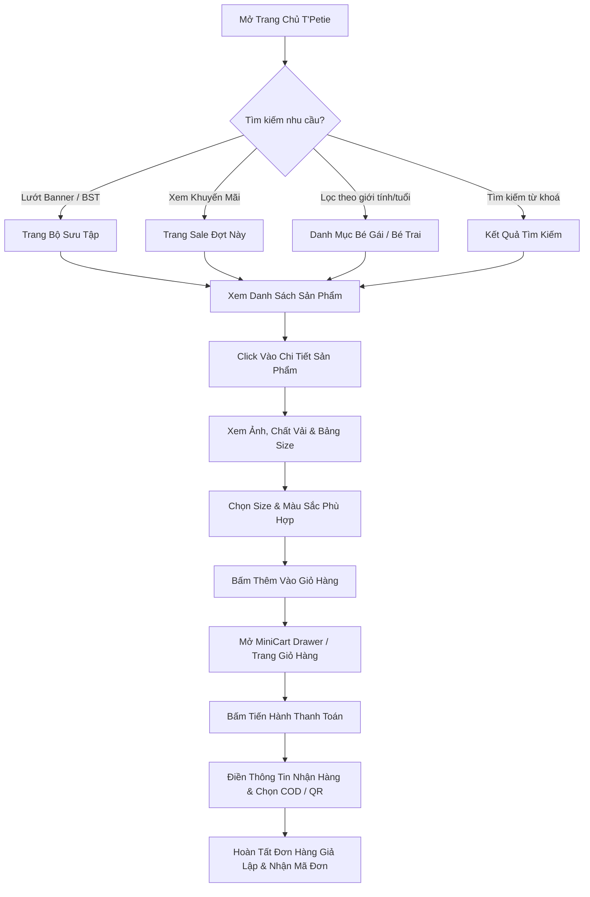

# Bản Đồ Hành Trình Khách Hàng (Customer Journey Map)

Tài liệu này mô tả chi tiết các giai đoạn tiếp xúc, cảm xúc và hành động của Mẹ Bỉm Sữa từ khi truy cập website T'Petie cho đến khi hoàn tất đơn hàng giả lập.

---

## 1. Sơ Đồ Tổng Thể Luồng Thao Tác (User Flow)

---

## 2. Ma Trận Hành Trình Chi Tiết (Journey Matrix)

| Giai đoạn | Hành động của Mẹ Bỉm | Tâm lý / Cảm xúc | Điểm chạm (Touchpoints) | Cơ hội tối ưu UX của T'Petie |
| :--- | :--- | :--- | :--- | :--- |
| **1. Khám phá (Discovery)** | Vào trang chủ qua link/mạng xã hội, xem banner và sản phẩm nổi bật | "Giao diện xinh xắn, màu dịu mắt, đồ bé gái có vẻ đẹp" | Hero Banner, Story Carousel, Thanh tìm kiếm nhanh | Tốc độ tải trang dưới 1.5s, không pop-up che màn hình |
| **2. Tìm kiếm & Lọc (Explore)** | Chọn tab "Bé gái" hoặc "Hương Cốm Mùa Thu", lọc theo cân nặng của con (10-12kg) | "Hy vọng lọc được đúng đồ vừa người bé để đỡ phải xem nhiều" | Thanh FilterBar dính trên mobile, Tag danh mục cuộn ngang | Bộ lọc size hiển thị kèm cân nặng rõ ràng (Size 2: 10-12kg) |
| **3. Đánh giá (Evaluate)** | Bấm vào váy hoa nhí, zoom ảnh cận vải, xem mô tả chất liệu và hướng dẫn giặt | "Vải có mềm không? Có bí mồ hôi không? Bé nhà mình 11kg mặc size nào?" | Bộ sưu tập ảnh sản phẩm, Tag chất liệu hữu cơ, Nút "Bảng size" | Đặt bảng gợi ý size theo tháng tuổi/cân nặng ngay dưới nút chọn size |
| **4. Quyết định (Action)** | Chọn size 2, bấm "Thêm vào giỏ" hoặc "Mua ngay" | Hài lòng vì biết trước giá tiền chính xác của từng size | Sticky Bottom Bar trên mobile, Nút CTA màu vàng mật ong nổi bật | Hiệu ứng rung nhẹ hoặc toast thông báo "Đã thêm vào giỏ" kèm âm thanh dịu nhẹ |
| **5. Thanh toán (Checkout)** | Mở giỏ hàng, điền tên + SĐT + địa chỉ, chọn thanh toán QR Momo/Ngân hàng | "Thủ tục nhanh gọn, không cần đăng ký tài khoản rườm rà" | Form thanh toán 1 bước, Tóm tắt đơn hàng rõ ràng | Tự động tính phí ship ưu đãi, hỗ trợ quét mã QR ngân hàng giả lập tức thì |
| **6. Sau mua hàng (Post-purchase)** | Xem màn hình xác nhận đơn, nhận mã đơn hàng và lời cảm ơn dễ thương | "Cảm giác an tâm và muốn quay lại mua tiếp" | Trang Thank You kèm nút liên hệ hỗ trợ Zalo/Hotline | Nút chia sẻ lên Facebook/Zalo để khoe đồ xinh của bé |
